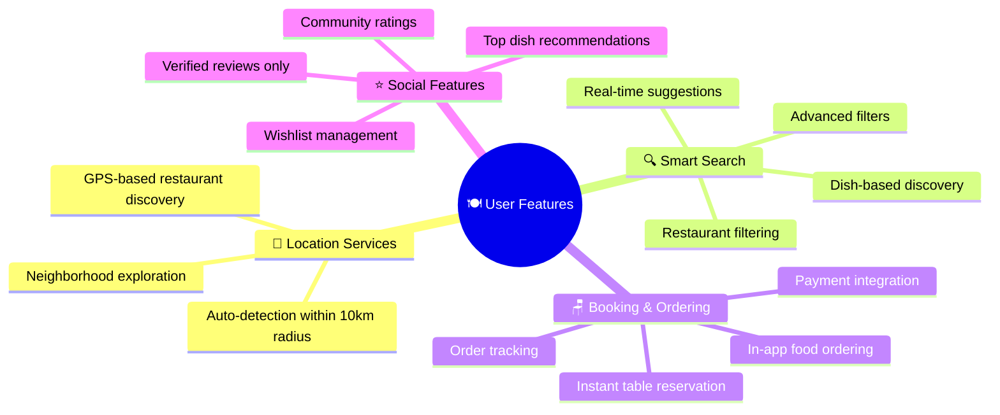
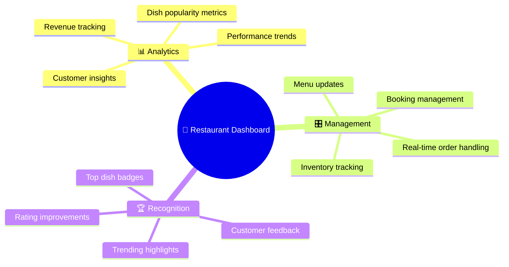
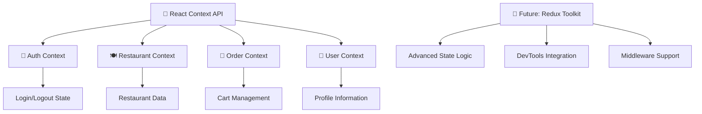

# 🍽️ **Platter** - Smart Restaurant Discovery Frontend

<div align="center">


**Lightning-fast React frontend for the ultimate restaurant discovery experience**

[](https://reactjs.org/)
[](https://vitejs.dev/)
[](https://tailwindcss.com/)
[](https://axios-http.com/)

---

### ✨ *"Where culinary dreams meet digital innovation"*

</div>

## 🌟 **What Makes Our Frontend Special?**

<table>
<tr>
<td width="50%">

### 🎯 **User Experience Magic**
- ⚡ **Lightning Fast** - Vite-powered instant loading
- 📱 **Responsive Design** - Perfect on any device
- 🎨 **Modern UI/UX** - Clean, intuitive interface
- 🌙 **Dark Mode Ready** - Eye-friendly browsing
- 🔄 **Real-time Updates** - Live order & booking status
- 💫 **Smooth Animations** - Delightful micro-interactions

</td>
<td width="50%">

### 🚀 **Technical Excellence**
- 🏗️ **Scalable Architecture** - Component-based design
- 🔒 **Secure Authentication** - JWT token management
- 📊 **State Management** - Context API + Future Redux
- 🎯 **SEO Optimized** - Better search visibility
- 🧪 **Testing Ready** - Jest & Testing Library setup
- 📦 **Production Ready** - Optimized build process

</td>
</tr>
</table>

---

## 🍴 **Core Features**

<div align="center">

### 👨‍🍳 **For Food Lovers**

</div>



<div align="center">

### 🏪 **For Restaurant Partners**

</div>



---

## 🛠️ **Technology Stack**

<div align="center">

### ⚡ **Frontend Powerhouse**

</div>

<table>
<tr>
<td align="center">

<br><strong>UI Library</strong>
<br><em>Component-based architecture</em>
</td>
<td align="center">

<br><strong>Build Tool</strong>
<br><em>Lightning-fast development</em>
</td>
<td align="center">

<br><strong>Styling</strong>
<br><em>Utility-first CSS</em>
</td>
<td align="center">

<br><strong>Navigation</strong>
<br><em>Client-side routing</em>
</td>
</tr>
<tr>
<td align="center">

<br><strong>HTTP Client</strong>
<br><em>API communication</em>
</td>
<td align="center">

<br><strong>State Management</strong>
<br><em>Global state handling</em>
</td>
<td align="center">

<br><strong>Authentication</strong>
<br><em>Secure token storage</em>
</td>
<td align="center">

<br><strong>Location Services</strong>
<br><em>Future integration</em>
</td>
</tr>
</table>

---

## 📁 **Project Architecture**

```
🍽️ platter-frontend/
├── 🌐 public/
│   └── index.html              # Main HTML template
├── 📱 src/
│   ├── 🎨 assets/              # Images, icons, static files
│   ├── 🧩 components/          # Reusable UI components
│   │   ├── Header.jsx          # Navigation header
│   │   ├── Footer.jsx          # Site footer
│   │   ├── Card.jsx            # Restaurant/dish cards
│   │   └── ...                 # More components
│   ├── 📄 pages/               # Route-based page components
│   │   ├── Home.jsx            # Landing page
│   │   ├── Search.jsx          # Search interface
│   │   ├── Restaurant.jsx      # Restaurant details
│   │   └── ...                 # More pages
│   ├── 🛣️ routes/              # Routing configuration
│   ├── 🔌 services/            # API integration layer
│   │   ├── api.js              # Axios configuration
│   │   └── auth.js             # Authentication services
│   ├── 🛠️ utils/               # Helper functions
│   ├── 🎯 App.jsx              # Root component
│   └── 🚀 main.jsx             # Application entry point
├── 🌍 .env                     # Environment variables
└── ⚙️ vite.config.js           # Vite configuration
```

---

## 🚀 **Quick Start Guide**

### 🔧 **Installation Process**

```bash
# 📥 Clone the repository
git clone https://github.com/Spidy29/platter-frontend.git
cd platter-frontend

# 📦 Install dependencies
npm install

# ⚙️ Setup environment variables
cp .env.example .env
# Edit .env with your API configuration

# 🎯 Start development server
npm run dev
```

### 🌍 **Environment Setup**

Create your `.env` file:

```env
# 🔗 API Configuration
VITE_API_BASE_URL=http://localhost:5000/api
VITE_APP_NAME=Platter

# 🗺️ Maps Integration (Future)
VITE_GOOGLE_MAPS_API_KEY=your_maps_api_key

# 🔐 Authentication
VITE_JWT_SECRET=your_jwt_secret

# 🎨 Theme Configuration
VITE_DEFAULT_THEME=light
```

---

## ⚡ **Development Scripts**

<div align="center">

| Command | Action | Description |
|---------|--------|-------------|
| `npm run dev` | 🚀 **Development** | Start dev server with hot reload |
| `npm run build` | 📦 **Production** | Create optimized production build |
| `npm run preview` | 👀 **Preview** | Preview production build locally |
| `npm run lint` | 🔍 **Code Quality** | Run ESLint for code analysis |
| `npm run test` | 🧪 **Testing** | Run test suite with Jest |

</div>

---

## 🎯 **State Management Strategy**

<div align="center">



</div>

### 🧠 **Current Implementation**
- **Context API** for global state management
- **LocalStorage** for persistent authentication
- **Axios Interceptors** for automatic token attachment
- **Custom Hooks** for reusable state logic

### 🚀 **Future Scaling**
- Migration to **Redux Toolkit** for complex state
- **RTK Query** for advanced data fetching
- **State persistence** with Redux Persist

---

## 🌟 **Future Roadmap**

### 🎯 **Upcoming Features**
```
timeline
    title Platter Frontend Evolution

    section Phase 1 : Foundation
        Core UI Components    : Basic layout and navigation
        Authentication Flow   : Login/Register functionality
        Restaurant Discovery  : Search and listing features

    section Phase 2 : Enhancement
        Google Maps Integration : Real-time location services
        Payment Gateway        : Razorpay/Stripe integration
        Dark Mode Support      : Theme switching capability

    section Phase 3 : Advanced
        PWA Implementation     : Offline-first experience
        Push Notifications     : Real-time order updates
        Advanced Analytics     : User behavior tracking

    section Phase 4 : Premium
        AI Recommendations     : Machine learning suggestions
        AR Menu Experience     : Augmented reality features
        Voice Search           : Speech recognition integration


### 🔌 **Backend Communication**

</div>

```javascript
// 🎯 Axios Configuration Example
const api = axios.create({
  baseURL: import.meta.env.VITE_API_BASE_URL,
  timeout: 10000,
  headers: {
    'Content-Type': 'application/json'
  }
});

// 🔐 Request Interceptor - Auto-attach JWT
api.interceptors.request.use((config) => {
  const token = localStorage.getItem('token');
  if (token) {
    config.headers.Authorization = `Bearer ${token}`;
  }
  return config;
});
```

### 🛡️ **Security Features**
- **JWT Token Management** - Secure authentication flow
- **Request Interceptors** - Automatic token attachment
- **Error Handling** - Graceful API error management
- **Rate Limiting** - Client-side request throttling

---

## 🤝 **Contributing to Platter Frontend**

<div align="center">

**Join our mission to revolutionize food discovery!**

[](https://github.com/Spidy29/platter-frontend/issues)
[](https://github.com/Spidy29/platter-frontend/issues?q=is%3Aissue+is%3Aopen+label%3A%22good+first+issue%22)

</div>

### 🌟 **How to Contribute**

1. 🍴 **Fork** the repository
2. 🌿 **Create** your feature branch (`git checkout -b feature/amazing-feature`)
3. 💾 **Commit** your changes (`git commit -m 'Add amazing feature'`)
4. 📤 **Push** to the branch (`git push origin feature/amazing-feature`)
5. 🔄 **Open** a Pull Request

### 📋 **Development Guidelines**

- Follow **React best practices** and hooks patterns
- Use **Tailwind CSS** for consistent styling
- Write **clean, documented code** with meaningful comments
- Add **proper error handling** for all API calls
- Test your changes on **multiple screen sizes**
- Follow the established **folder structure**

---

## 📞 **Connect With the Creator**

<div align="center">

### 👨‍💻 **Arjun Sharma**
*Full Stack Developer & UI/UX Enthusiast*

[](mailto:ar29061999@gmail.com)
[](https://linkedin.com/in/iarjun2903)
[](https://github.com/Spidy29)

---

### 💬 **Let's Build Something Amazing Together!**

*Have ideas for new features or found a bug?*  
*Want to collaborate on the next big food-tech innovation?*  
*Drop me a message - let's make dining digital! 🚀*

</div>

---

<div align="center">

### 🌟 **If this project inspired you, give it a star!**

[](https://github.com/Spidy29/platter-frontend/stargazers)
[](https://github.com/Spidy29/platter-frontend/network)

---

*Crafted with 💜 and powered by ☕ for food lovers worldwide*

**© 2024 Platter Frontend. Building the future of dining, one component at a time.**

</div>
